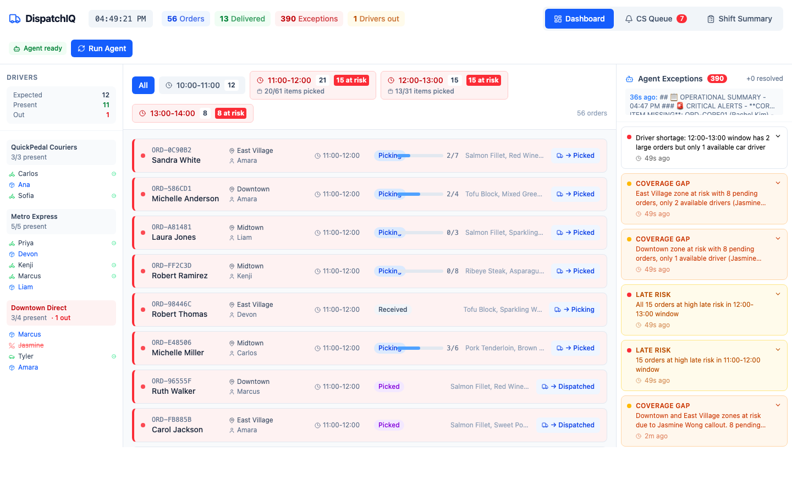

# DispatchIQ: Agentic Operations Assistant for Last-Mile Delivery

## The Problem

In last-mile delivery operations, the ops manager can be the single point of failure. Every exception- late orders, missing items, driver call-outs, coverage gaps- runs through one person's brain. When things get busy, manual processes get dropped. The customer service team only finds out about a problem if the ops manager physically walks over and tells them. Critical items ship without customers being notified they're missing. Incoming shift managers inherit chaos with no structured briefing.

**DispatchIQ replaces the human bottleneck with an AI agent that monitors, decides, and acts.**

## How It Works

DispatchIQ is a full-stack operations dashboard powered by an agentic AI system. The agent continuously monitors order flow and takes action when it detects problems.

### Real-Time Exception Detection

The agent calculates risk across every delivery window: orders remaining vs. time left vs. available drivers per zone. When the math doesn't work, it flags the problem before it becomes a missed delivery.

### Coverage Gap Analysis

Drivers are categorized by type (biker vs. driver) and zone (Uptown, Midtown, Chelsea, East Village, Downtown). When a driver calls out sick, the agent immediately identifies which zones are uncovered and which delivery windows are at risk — then recommends reallocation.

### Missing Item Escalation

When an item is missing during picking, the agent evaluates criticality. If it's a core item (like the main protein in a meal order), the agent blocks dispatch and generates a customer notification with a substitution or refund offer. Minor missing items get logged and communicated post-delivery. **No order ships with a missing core item without the customer knowing.**

### CS Notification Queue

Instead of the ops manager walking across the floor to tell customer service about a problem, the agent auto-generates notifications with order details, what happened, and a suggested customer communication script. CS marks each one as handled.

### Shift Summary

At any point, the agent generates a structured briefing: orders completed, orders late, delivery window progress, open exceptions, and unresolved CS items. An incoming shift manager reads this in 30 seconds and knows exactly what they're inheriting.

## Why This Matters

This tool was built from firsthand experience managing last-mile delivery operations. The problems it solves are real:

- **The "chicken breast problem"**: A customer orders four items. The one thing that's missing is the main item. The order ships anyway because nobody had time to flag it. The customer gets a bag of sides with no main course. DispatchIQ catches this before dispatch.

- **The "coverage gap problem"**: You have 7 bikers but 0 drivers for downtown. Downtown orders are too far for bikers. You don't realize the gap until orders start going late. DispatchIQ flags coverage gaps the moment a driver calls out.

- **The handoff problem**: The incoming manager gets a verbal briefing and a Slack scroll. Critical context gets lost. DispatchIQ generates a structured shift summary so nothing falls through the cracks.

## Tech Stack

- **Backend**: FastAPI (Python) with Anthropic Claude API for agent intelligence
- **Frontend**: React (TypeScript) with Vite
- **Agent Architecture**: Claude tool use for exception detection, CS notification generation, coverage analysis, and shift summaries
- **Storage**: JSON-based (orders, drivers, exceptions)

## Screenshots

Demo data only — safe to share publicly.

| Operations dashboard | CS notification queue | Shift summary |
|:---:|:---:|:---:|
|  |  |  |

Deep links (for docs or sharing a specific view): `?tab=dashboard`, `?tab=cs-queue`, `?tab=shift-summary`.

To regenerate images locally (Chrome on macOS, with the API and Vite already running): `./scripts/capture-readme-screenshots.sh`

## Setup

### Prerequisites
- Python 3.9+
- Node.js 18+
- **Optional:** An Anthropic API key ([console.anthropic.com](https://console.anthropic.com)) — only needed for **Run Agent** and other Claude-powered features. The dashboard loads with bundled demo data without it.

### Installation

```bash
git clone https://github.com/jtmcc99/dispatchiq.git
cd dispatchiq

python3 -m venv venv
source venv/bin/activate
pip install -r backend/requirements.txt

cd frontend
npm install
```

### Run

The UI talks to the API through Vite’s dev proxy at **http://localhost:8000**. Start the backend first, then the frontend.

```bash
# Terminal 1 — API
source venv/bin/activate
cd backend
uvicorn main:app --reload --host 127.0.0.1 --port 8000

# Terminal 2 — UI (from repo root)
cd frontend
npm run dev
```

Open the URL Vite prints (usually **http://localhost:5173**). If that port is busy, Vite picks the next port — use the **Local** URL from the terminal.

**Anthropic key (optional):** To use **Run Agent**, set the key in the same shell before `uvicorn`:

```bash
export ANTHROPIC_API_KEY="your-key"
```

Never commit API keys. This repo ignores `.env` files; keep secrets in environment variables or a local `.env` that stays on your machine.

### Security note for public clones

All data in this repo is **synthetic demo content**. Do not add real customer names, addresses, or internal URLs to committed files.

## Agent Capabilities

| Capability | What it does | How it decides |
|-----------|-------------|---------------|
| Late risk detection | Flags orders at risk of missing their delivery window | Orders remaining × time left × available drivers |
| Coverage gap detection | Identifies zones without enough drivers | Driver type + zone assignment + call-outs |
| Missing item escalation | Blocks dispatch of orders missing core items | Item criticality assessment |
| CS notification | Generates customer communication scripts | Exception type + severity + order details |
| Smart driver reservation | Warns before assigning a driver to an order a biker could handle | Order size/weight + remaining driver pool + upcoming order queue |
| Shift summary | Creates end-of-shift briefing | Aggregates all metrics + open exceptions |

## Changelog

### v2 — Product Iteration (April 2026)
Changes based on hands-on testing and operational experience:

- **Smart driver reservation**: Agent warns when assigning a driver to a small order would leave no drivers for upcoming large/heavy orders. Prevents the common mistake of burning your only driver on a delivery a biker could handle.
- **Batched CS notifications**: OOS items accumulate per order and send as one notification when picking is complete — unless it's a core item, which triggers an immediate alert. Customers get one call, not five.
- **Pick progress visibility**: Delivery windows show items picked vs. total (20/61), and individual orders show progress (2/7). Ops managers can see at a glance whether a window will make it.
- **Drivers grouped by company**: Reorganized from zone-based to company-based grouping, reflecting how staffing actually works when everyone ships from one warehouse.
- **Expected vs. present staffing**: Replaced "X out sick" with "Expected: 12 | Present: 11 | Out: 1" for immediate clarity on staffing levels.
- **Large/heavy order flagging**: Orders requiring a driver (20+ items or heavy goods) are flagged before dispatch so they don't get assigned to a biker.
- **Shift summary redesign**: Replaced markdown wall with scannable card layout — critical issues at top, progress bars for delivery windows, numbered priorities for next shift.

## What's Next

- [ ] Historical analytics: track exception patterns over days/weeks
- [ ] Driver performance tracking
- [ ] Predictive late risk using historical delivery times
- [ ] SMS/push notifications for real-time driver communication
- [ ] Multi-location support

## Background

Built from firsthand experience managing delivery operations at a startup where the entire exception management process ran through one person's brain, Slack messages, and word of mouth. DispatchIQ demonstrates how agentic AI can replace human bottlenecks in real-time operations — not by removing the human, but by giving them an intelligent system that monitors, decides, and acts alongside them.

## License

See [LICENSE](LICENSE) (MIT).
